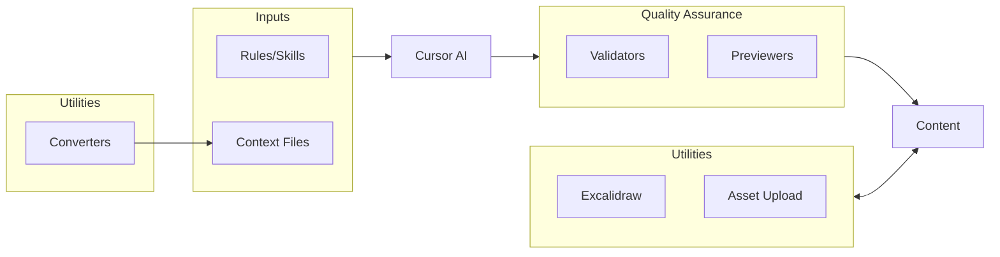

# Content Creation System

An AI-powered system for generating, validating, and previewing DataCamp course content using Cursor.

---

## Table of Contents

1. [Setup](#setup)
2. [System Architecture](#system-architecture)
3. [How to Use](#how-to-use)
4. [Best Practices & Context Engineering](#best-practices--context-engineering)
5. [Common Pitfalls](#common-pitfalls)
6. [How to Improve This System](#how-to-improve-this-system)

---

## Setup

### External Tools & Why We Use Them

This system relies on several external tools to provide best-in-class content conversion and diagram generation:

| Tool | Purpose | Why We Use It |
|------|---------|---------------|
| **Datalab API** | PDF to Markdown conversion | Best-in-class document parsing with layout preservation |
| **Docling** | HTML to Markdown conversion | Local conversion without API dependency |
| **Trafilatura** | Web page content extraction | Strips ads/navigation, extracts main content cleanly |
| **YouTube Transcript API** | Video transcript extraction | Reliable access to YouTube captions |
| **Puppeteer** | Excalidraw PNG rendering | Headless browser for diagram generation |
| **Sharp** | Image optimization | Fast image processing for Node.js |

---

### First-Time Setup

Follow these steps exactly if you're setting up the content creation tools for the first time.

#### Step 1: Get the Files

**For new courses:** The `.cursor` folder is automatically included when you create a course from a DataCamp template.

**For existing courses:** Copy the `.cursor` folder, `.cursorrules`, and `scripts/` from the [content_authoring_cursor](https://github.com/datacamp/content_authoring_cursor) repository.

#### Step 2: Run the Setup Script

Open your terminal in the course repo and run:

```bash
chmod +x .cursor/utilities/setup.sh
.cursor/utilities/setup.sh
```

**What this does:**
- Creates a Python virtual environment at `.venv/`
- Installs Python packages (content converters, validators)
- Installs Node.js packages (Puppeteer, Sharp for diagram generation)

#### Step 3: Configure API Keys

1. Create a `.env` file inside the `.cursor` directory. You can either:
   - Copy the example file and edit it:
     ```bash
     cp .cursor/.env.example .cursor/.env
     ```
   - Or, create a new `.env` file directly inside `.cursor` and edit it.

2. Open `.cursor/.env` and fill in your keys:
   ```
   # Required for PDF conversion (find in 1Password under "Datalab")
   DATALAB_API_KEY=your_datalab_api_key
   
   # Required for asset upload.
   DATACAMP_DCT=your_dct_cookie_value

   # How to find your DATACAMP_DCT value:
   # 1. In your Chrome browser, open https://www.datacamp.com or your DataCamp repo page and log in.
   # 2. Right-click on the page, select "Inspect" to open DevTools.
   # 3. Go to the "Application" tab, then expand "Cookies" in the left sidebar and select https://www.datacamp.com. (Press on >> next to Network to find Applications)
   # 4. Look for the cookie named "_dct".
   # 5. Copy the full value of the "_dct" cookie (double-click the value to select).
   # 6. Paste it, replacing "your_dct_cookie_value".
   
   # Your course repository URL
   DATACAMP_REPO=https://github.com/datacamp-content/courses-your-course-name
   ```

#### Step 4: Verify Installation

Run the verification script to test everything works:

```bash
chmod +x .cursor/utilities/verify_setup.sh
.cursor/utilities/verify_setup.sh
```

All checks should pass. If any fail, see the [Troubleshooting](#troubleshooting) section.

---

### Returning User Setup

If you've already set up once, here's your quick start:

```bash
# 1. Activate the virtual environment
source .venv/bin/activate

# 2. Update to latest rules (recommended)
./scripts/update_cursor_rules.sh

# 3. Ready to use!
```

---

### Troubleshooting

| Issue | Solution |
|-------|----------|
| `ModuleNotFoundError` | Run `source .venv/bin/activate` then `pip install -r .cursor/requirements.txt` |
| PDF conversion fails | Ensure `brotli>=1.2.0` is installed: `pip install brotli>=1.2.0` |
| API key not found | Check that `.cursor/.env` exists and contains `DATALAB_API_KEY=...` |
| Asset upload fails | Verify `DATACAMP_DCT` and `DATACAMP_REPO` are set in `.cursor/.env` |
| Excalidraw fails | Run `npm install` in the project root |

Generally, Cursor is great at debugging installation. So use it to your advantage.

---

## System Architecture

Cursor AI is the orchestrator that takes inputs, uses tools for quality assurance, and produces content:



### Rules (`rules/`)

Markdown files containing AI prompts and guidelines for generating different content types.

| Category | Files | Description |
|----------|-------|-------------|
| **Coding Exercises** | `python-coding-exercise.md`, `r-coding-exercise.md`, `sql-coding-exercise.md` | Single-step coding exercises |
| **Iterative Exercises** | `python-iterative-exercise.md`, `r-iterative-exercise.md`, `sql-iterative-exercise.md` | Multi-step BulletExercise (independent steps) |
| **Sequential Exercises** | `python-sequential-exercise.md`, `r-sequential-exercise.md`, `sql-sequential-exercise.md` | Multi-step TabExercise (code accumulates) |
| **Cloud Exercises** | `copilot-exercise.md`, `aws-exercise.md`, `azure-exercise.md`, `databricks-exercise.md` | Virtual machine exercises |
| **Desktop Exercises** | `tableau-exercise.md`, `powerbi-exercise.md` | Desktop application exercises |
| **AI/Prompting** | `chat-v2-exercise.md` | Gemini/ChatGPT prompting exercises |
| **Multiple Choice** | `single-mcq-exercise.md`, `multiple-mcq-exercise.md` | MCQ exercises |
| **Drag & Drop** | `drag-drop-classify-exercise.md`, `drag-drop-order-exercise.md` | Interactive exercises |
| **Explorable** | `explorable-exercise.md`, `react-explorable-exercise.md` | Shiny/React app exercises |
| **Video Scripts** | `generate-video-exercise.md` | Video slides and narration |
| **Course Outline** | `generate-course-outline.md` | Course specification |
| **SCT Generation** | `generate-sct-python.md`, `generate-sct-ai-vision.md` | Submission correctness tests |

### Validators (`validators/`)

Python scripts that check generated content for structural correctness and content quality.

| Validator | Purpose |
|-----------|---------|
| `python_coding_validator.py` | Python coding exercises |
| `python_iterative_validator.py` | Python iterative/bullet exercises |
| `python_sequential_validator.py` | Python sequential/tab exercises |
| `r_coding_validator.py`, `r_iterative_validator.py`, `r_sequential_validator.py` | R exercises |
| `sql_coding_validator.py`, `sql_iterative_validator.py`, `sql_sequential_validator.py` | SQL exercises |
| `copilot_validator.py`, `aws_validator.py`, `azure_validator.py`, `databricks_validator.py` | Cloud exercises |
| `tableau_validator.py`, `powerbi_validator.py` | Desktop app exercises |
| `chat_v2_validator.py` | AI prompting exercises |
| `explorable_validator.py`, `react_explorable_validator.py` | Interactive exercises |
| `video_script_validator.py` | Video scripts |

### Previewers (`preview/`)

HTML generators that show how content will appear on DataCamp.

| Generator | Output |
|-----------|--------|
| `generate_python_preview.py` | Python coding exercises |
| `generate_python_iterative_preview.py` | Python iterative exercises |
| `generate_python_sequential_preview.py` | Python sequential exercises |
| `generate_copilot_preview.py` | Copilot exercises |
| `generate_aws_preview.py`, `generate_azure_preview.py` | Cloud exercises |
| `generate_tableau_preview.py`, `generate_powerbi_preview.py` | Desktop exercises |
| `generate_chat_v2_preview.py` | AI prompting exercises |
| `generate_slides_preview.py` | Video slides with script panel |

### Utilities (`utilities/`)

| Utility | Purpose |
|---------|---------|
| `converters/convert_pdf.py` | PDF to Markdown (Datalab API) |
| `converters/convert_html.py` | HTML to Markdown (Docling) |
| `converters/convert_youtube.py` | YouTube transcript to Markdown |
| `converters/convert_webpage.py` | Web page to Markdown (Trafilatura) |
| `excalidraw/from_script.mjs` | Generate diagrams from markdown placeholders |
| `upload_assets.py` | Upload images to DataCamp CDN |
| `setup.sh` | Initial setup script |
| `verify_setup.sh` | Verify installation |

---

## Assessment Workflows

This system supports three assessment workflows, configured via `.cursor/project.yaml`.

### Workflow A: Chapter-Based Assessments
For creating assessments tied to a specific course chapter.

```
bash

# Initialize
./scripts/init_project.sh # select "chapter"

# Add content
# Copy slides/.md and exercises/.md from your course repo to context/

# Generate
# "Create 3 MCQs for Chapter 2 based on @context/slides/chapter_2.md"
```

### Workflow B: Track-Based Assessments

For creating assessments spanning multiple courses in a track.

```
bash

# Initialize
./scripts/init_project.sh  
# select "track"
# Add content (manual step)
# 1. Download content from DataCamp Teach for each course
# 2. Create folders: context/{course_name}/ for each course
# 3. Copy slides and exercises into each course folder
# 4. Update .cursor/project.yaml with course list
# 5. Fill in context/track_los.md with track objectives
# Generate
# "Create items covering pandas fundamentals across the track"
```

### Workflow C: Standalone Certification Pools
For creating certification items not tied to Learn content.

```
bash
# Initialize (new repo)
./scripts/init_project.sh  # select "standalone"

# OR add to existing repo
./scripts/update_cursor_rules.sh  # Pulls .cursor/ folder
./scripts/init_project.sh  # select "standalone"

# Add content
# Copy existing pool items to context/existing_items/
# Add reference docs to context/reference_docs/
# Fill in context/item_coverage.md

# Generate
# "Create 5 MCQs on pandas that don't overlap with @context/existing_items/"

```

### Switching Between Workflows
Edit .cursor/project.yaml and change the mode: field:
mode: chapter - Chapter-based
mode: track - Track-based
mode: standalone - Certification pools

---

## How to Use

### Philosophy

Content creation is an **iterative process**. The system is designed around this cycle:

```
Generate → Validate → Preview → Iterate → ... → Finalize → SCT
```

1. **Generate** — Create initial content with AI using good context
2. **Validate** — Run validators to catch structural errors
3. **Preview** — Visually inspect how it will appear on DataCamp
4. **Iterate** — Refine based on feedback
5. **Finalize** — Lock in the final content
6. **SCT** — Generate submission correctness tests

**Key principle:** Work lesson by lesson, exercise by exercise. Don't try to generate an entire chapter at once.

---

### Outlining

Before generating exercises, you need context. The converters turn external content into Markdown that the AI can use.

#### Converting Content to Markdown

Converting external content (like PDFs, web pages, or video transcripts) into Markdown is essential for providing accurate, high-quality source material when generating new course content. Cursor handles this conversion automatically for you whenever you need to work from these sources.

**What you need to do:**  
Simply add your context files (converted markdown) to the `context/` folder and ensure the `context/context_creator.md` file is filled out with relevant course context. This makes sure Cursor has the best information to generate and outline your course.

> **Note:** You do **not** need to run the conversion scripts manually. Cursor will prompt for or perform any necessary content conversion when you request content generation from a PDF, webpage, video, or HTML file.  
>  
> The commands below are shown for reference only.

<details>
<summary>Show reference commands</summary>

```bash
# Activate virtual environment first
source .venv/bin/activate

# Convert a PDF (requires DATALAB_API_KEY)
python .cursor/utilities/converters/convert_pdf.py document.pdf -o context/document.md

# Convert a YouTube video transcript
python .cursor/utilities/converters/convert_youtube.py "https://youtube.com/watch?v=VIDEO_ID" -o context/video.md

# Convert a web page
python .cursor/utilities/converters/convert_webpage.py "https://example.com/article" -o context/article.md

# Convert local HTML
python .cursor/utilities/converters/convert_html.py page.html -o context/page.md
```
</details>


#### Using Context for Outlining

Once you have markdown context files, reference them when generating content:

```
Create a course outline based on @context/document.md following @generate-course-outline.md
```

The AI uses your markdown files as source material to create accurate, grounded content.

---

### Video Generation

Video scripts follow a 7-step workflow. Here's a complete example:

#### Step 1: Request the Video

```
Generate a video on @slides/chapter_1.md about Introduction to Machine Learning
```

The assistant will ask:
- **Visual mode**: Full visuals (with diagrams) or no visuals (scripts only)?
- **Learning objectives**: What should learners be able to do?
- **Video flow**: What's the sequence of topics?

#### Step 2: Review the Draft

The assistant creates a draft at `.cursor/tmp_items/video_script_draft.md`. Review and request changes.

#### Step 3: Convert to DataCamp Format

Say "continue" or "looks good" to convert the draft to proper slide markdown.

#### Step 4: Validate

This command runs the video script validator on your script file for chapter 1, checking for formatting and structural issues:

```bash
python .cursor/validators/video_script_validator.py slides/chapter_1.md
```

#### Step 5: Generate Diagrams (Full Visuals Mode Only)

Use Cursor to open and edit the necessary files when updating or fixing skills, rules, or related modules. For diagram generation, run:

```bash
node .cursor/utilities/excalidraw/from_script.mjs slides/chapter_1.md --chapter 1 --lesson 1 --update
```

If you need to update skills, rules, or workflow steps, use Cursor to edit the corresponding files such as those in `.cursor/rules/`, `.cursor/validators/`, or this `README.md`. Always ensure the correct cursorrules and relevant scripts are updated through Cursor for consistent workflow and validation integration.

#### Step 6: Preview

```bash
python .cursor/preview/generate_slides_preview.py slides/chapter_1.md
open .cursor/tmp_items/slides_preview.html
```

#### Step 7: Upload Assets (Full Visuals Mode Only)

```bash
source .venv/bin/activate
python .cursor/utilities/upload_assets.py slides/chapter_1.md --update
```

**Result:** Local image paths become public DataCamp URLs.

---

### Exercise Generation

Here's a complete workflow for generating a Python coding exercise:

#### Step 1: Generate

```
Create a Python coding exercise about list comprehensions based on @slides/chapter_2.md
```

The assistant generates the exercise and saves it to `.cursor/tmp_items/exercise_to_validate.md`.

#### Step 2: Validate

```bash
python .cursor/validators/python_coding_validator.py .cursor/tmp_items/exercise_to_validate.md
```

#### Step 3: Preview

```bash
python .cursor/preview/generate_python_preview.py .cursor/tmp_items/exercise_to_validate.md
```

The preview opens automatically in your browser.

#### Step 4: Iterate

Request changes:
```
Make the context more engaging and add a hint about the syntax
```

Re-validate and re-preview after each change.

#### Step 5: Finalize

```
Give me the final markdown
```

The assistant outputs clean markdown ready to copy into your chapter file.

#### Step 6: Generate SCT

```
Generate SCT for this exercise
```

The assistant adds submission correctness tests using `pythonwhat`.

---

### SCTs (Submission Correctness Tests)

SCTs validate learner submissions and provide feedback. Generate them **after** finalizing exercise content.

**For Python/R/SQL exercises:**
```
Generate SCT using @generate-sct-python.md
```

**For cloud/VM exercises (Copilot, AWS, etc.):**
```
Generate SCT using @generate-sct-ai-vision.md
```

The assistant will ask which SCT flavor you need:
- **Input only** — Evaluate learner's prompts/actions
- **Output only** — Evaluate the tool's generated results
- **Input and output** — Check both

---

## Best Practices & Context Engineering

The quality of generated content depends on the context you provide. **Better context = better exercises.**

### Bad Example

```
Create a copilot exercise
```

**Why it's bad:**
- No reference to source material
- No learning objectives
- No exercise flow
- AI has to guess everything

### Good Example

```
Create a copilot exercise based on @slides/chapter_1.md with the following context:
```

| Field | Value |
|-------|-------|
| **Exercise title** | Build a Deck |
| **Learning objectives** | 1. Navigate Microsoft Copilot<br>2. Upload a file<br>3. Generate a deck |
| **Exercise flow** | 1. Open PowerPoint → 2. Click upload → 3. Select file → 4. Prompt "Create presentation" → 5. Review |
| **Syntax introduced** | "Create a presentation from this file", "Add more slides about [topic]" |
| **Metaphors** | Copilot is your presentation assistant—you provide the outline, it creates the slides |
| **Datasets** | Sample document about quarterly sales |

**Why it's good:**
- References source slide with `@slides/...`
- Clear learning objectives
- Exact exercise flow
- Specific prompts to teach
- Helpful metaphor
- Defined sample data

### Key Principles

1. **Reference source material** — Use `@` to link to slides, scripts, or docs
2. **Define learning objectives** — What should learners be able to do?
3. **Provide exercise flow** — Step-by-step sequence
4. **List syntax/commands** — Specific code or prompts being taught
5. **Include metaphors** — Analogies that explain concepts
6. **Specify datasets** — Files or data needed
7. **Add constraints** — Word limits, difficulty level, emphasis points

---

## Common Pitfalls

### Keys Hallucination

**Problem:** The AI generates exercise keys like `key: abc123def` instead of leaving them empty.

**Why it matters:** Keys are assigned by the Teach platform when you save. Pre-filled keys cause conflicts.

**Solution:** Keys must always be empty: `key:`

**Detection:** Validators catch this automatically. If you see a key error, just delete the generated value.

**Example:**
```yaml
# Wrong
key: 8b5f742d11

# Correct
key:
```

### Breaking Down Lesson by Lesson

**Problem:** Trying to generate an entire chapter of exercises at once.

**Why it matters:**
- AI loses context with too much content
- Harder to iterate and refine
- More likely to have inconsistencies
- Errors compound

**Solution:** Work on one lesson at a time, one exercise at a time.

**Good workflow:**
```
1. Generate exercise 1 for lesson 2.1
2. Validate → Preview → Iterate
3. Finalize exercise 1
4. Generate exercise 2 for lesson 2.1
5. ...repeat...
```

**Bad workflow:**
```
Generate all 12 exercises for chapter 2
```

### Forgetting to Activate Virtual Environment

**Problem:** Running Python scripts without activating `.venv/` first.

**Symptom:** `ModuleNotFoundError: No module named 'trafilatura'`

**Solution:** Always run `source .venv/bin/activate` before using converters or validators.

### Stale Rules

**Problem:** Using outdated rules that don't reflect latest best practices.

**Solution:** Regularly update rules:
```bash
./scripts/update_cursor_rules.sh
```

---

## How to Improve This System

This system gets better through use. Here's how to contribute:

### 1. Use It

The more you use the system, the more edge cases you discover. Pay attention to:
- When the AI generates incorrect structure
- When validators miss errors
- When previews don't match Teach
- When workflows feel clunky

### 2. Update Relevant Skills

When you spot an issue, use the cursor assistant and its tools to help you update the relevant files:

| Issue Type | How to Update |
|------------|--------------|
| AI generates wrong format | Update `rules/{exercise-type}.md` using cursor |
| Validator misses an error | Edit `validators/{type}_validator.py` with cursor |
| Preview looks wrong | Revise `preview/generate_{type}_preview.py` using cursor |
| Workflow unclear | Improve this `README.md` via cursor |

Utilizing cursor ensures consistency and leverages built-in validation and preview workflows.

### 3. Submit a Pull Request

Push your improvements to the shared repository:

```bash
# Clone the rules repo
git clone https://github.com/datacamp/content_authoring_cursor.git
cd content_authoring_cursor

# Create a branch
git checkout -b fix/validator-missing-check

# Make your changes
# ...edit files...

# Commit with a detailed message
git add -A
git commit -m "Fix: Python validator now catches missing hint field

- Added check for empty @hint section
- Added helpful error message explaining the fix
- Updated test cases"

# Push and create PR
git push -u origin fix/validator-missing-check
```

**Good commit messages include:**
- What was broken
- What you fixed
- Why it matters

Your improvements help everyone creating DataCamp content!
